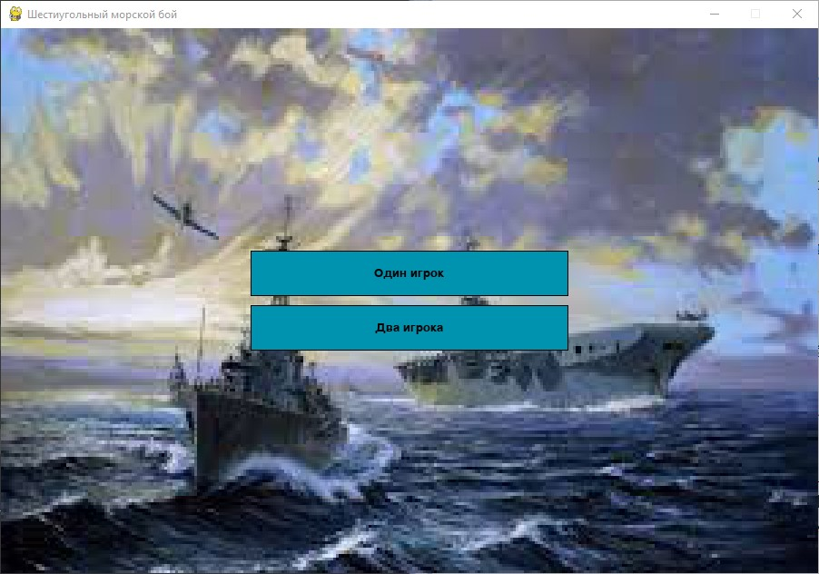
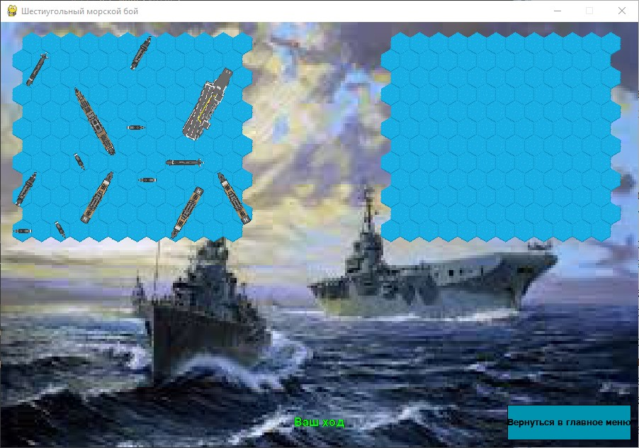
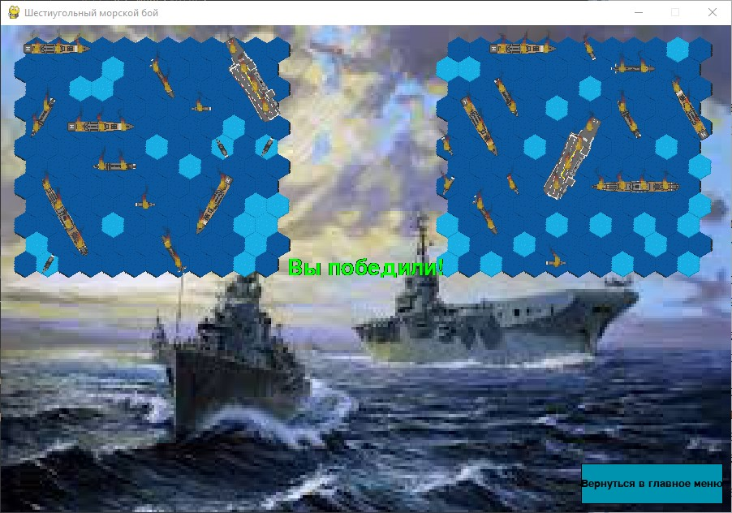
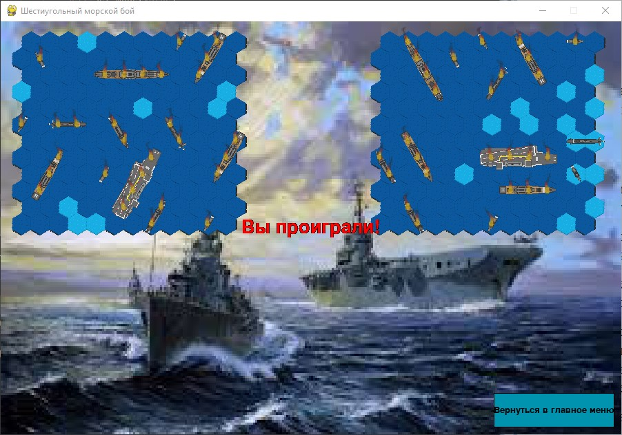
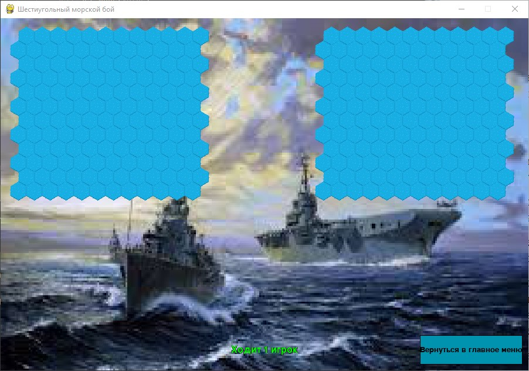
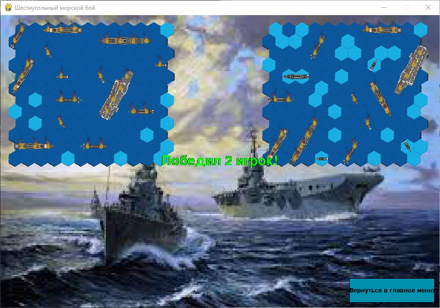
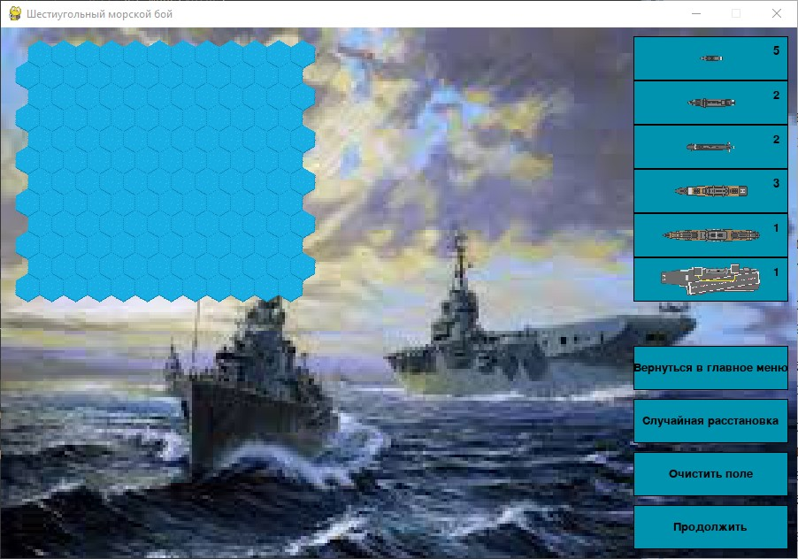

# Шестиугольный морской бой

## Сборка и запуск

 1. Скачать и распаковать архив с проектом
 2. В папке с проектом выполнить команду

        pip install -r requirements.txt

 3. Запустить файл main.py

        python main.py

## Краткое описание

**Техническое задание**: создание игры "Морской бой", базирующейся на поле 
с шестиугольными клетками с возможностью игры как против компьютера, так и против другого игрока

## Возможности программы

 - Игра в морской бой 
   
    

     - Против компьютера 
       
         
         
         

     - Против другого игрока \(на одном устройстве\)
   
        
        
   
 - Предварительная расстановка кораблей на поле, в том числе при помощи функции случайной расстановки
    
    - Перемещение корабля происходит путём перетаскивания мышью 
    - Поворот осуществляется при помощи колёсика мыши
    - Изначально корабли находятся в хранилище. Удерживайте ЛКМ на кнопке с нужным типом 
      корабля, чтобы он появился под курсором

    

## Правила игры

Несмотря на нестандартные форму и размер поля, а также на увеличенное количество кораблей, 
основные правила не отличаются от правил оригинального "Морского боя"

 - Перед началом игры игроки расставляют корабли на своих полях
 - Корабли не должны находиться на соседних клетках и/или пересекаться друг с другом
 - Игроки по очереди выбирают, по какой клетке вражеского поля им выстрелить. Успешное попадание 
   по вражескому кораблю даёт право на повторный выстрел
 - Игра продолжается, пока у одного из игроков не закончатся корабли
 - Побеждает игрок, первым уничтоживший все корабли противника
   
## Используемые эффекты
 - Взрыв при промахе
      
 

 - Взрыв при попадании в корабль
      
 

 - Огонь на месте попадания
   
 

## Предполагаемый процесс игры между двумя игроками

 1. Первый игрок расставляет свои корабли, второй игрок в это время отворачивается 
    (или секретность расстановки обеспечивается другим способом на усмотрение игроков)
 2. Первый игрок заканчивает расстановку своих кораблей, нажимает "продолжить", зовёт второго 
    игрока и отворачивается   
 3. Второй игрок расставляет свои корабли, нажимает "продолжить" и зовёт первого игрока
 4. Игроки по очереди делают ходы. "Живые" корабли скрыты, поэтому оба игрока могут одновременно 
    находиться за компьютером
